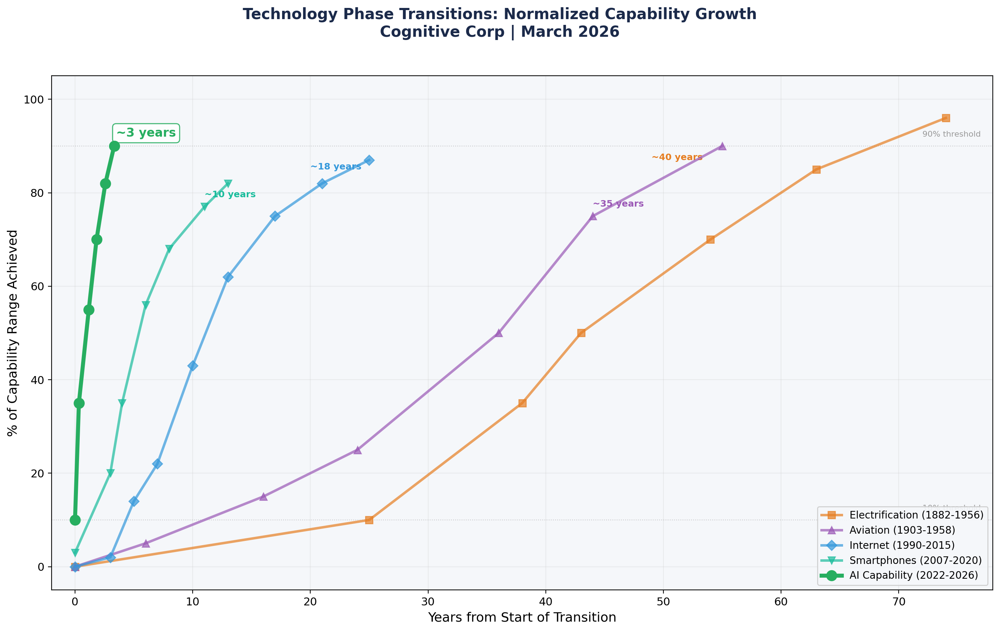
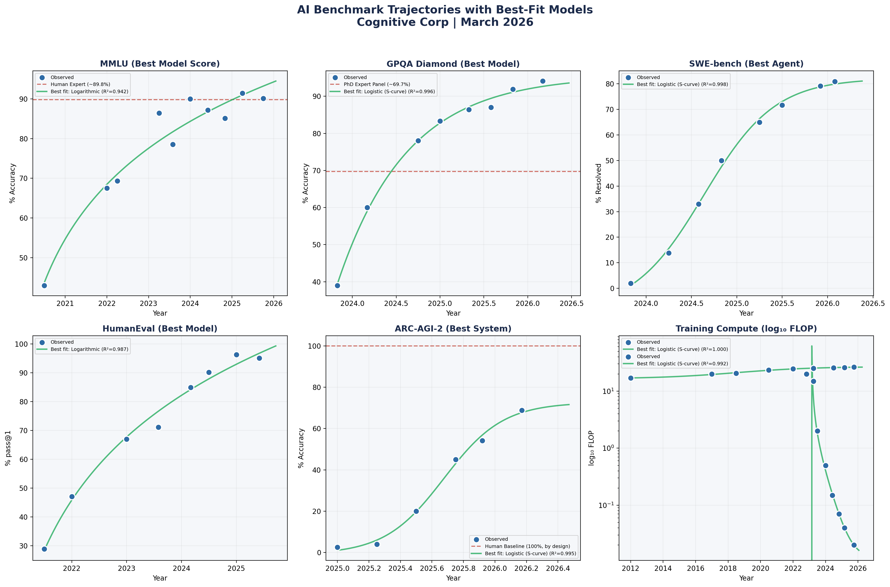
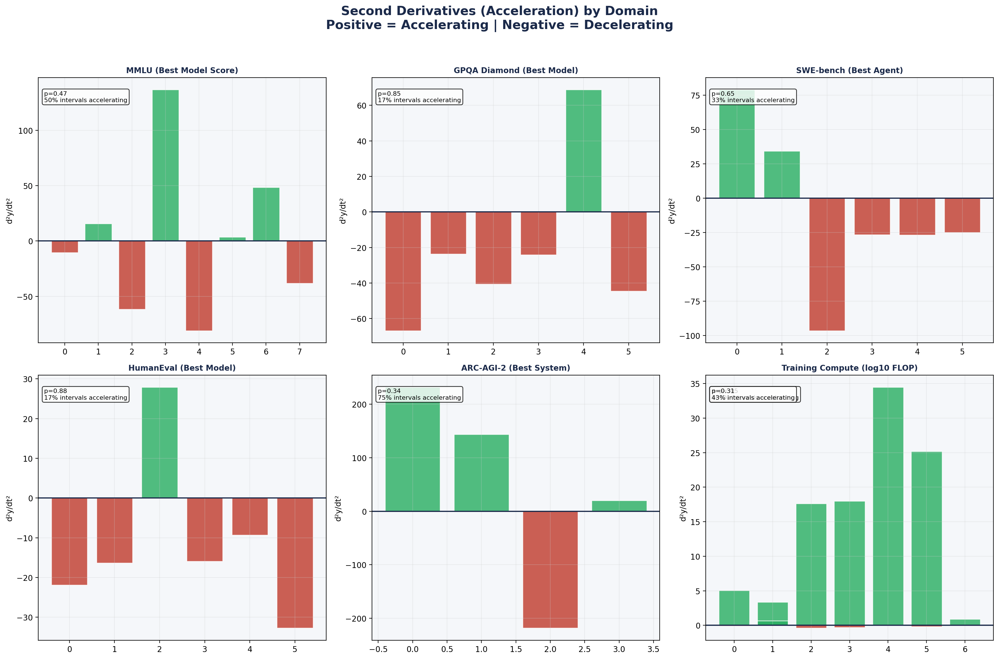
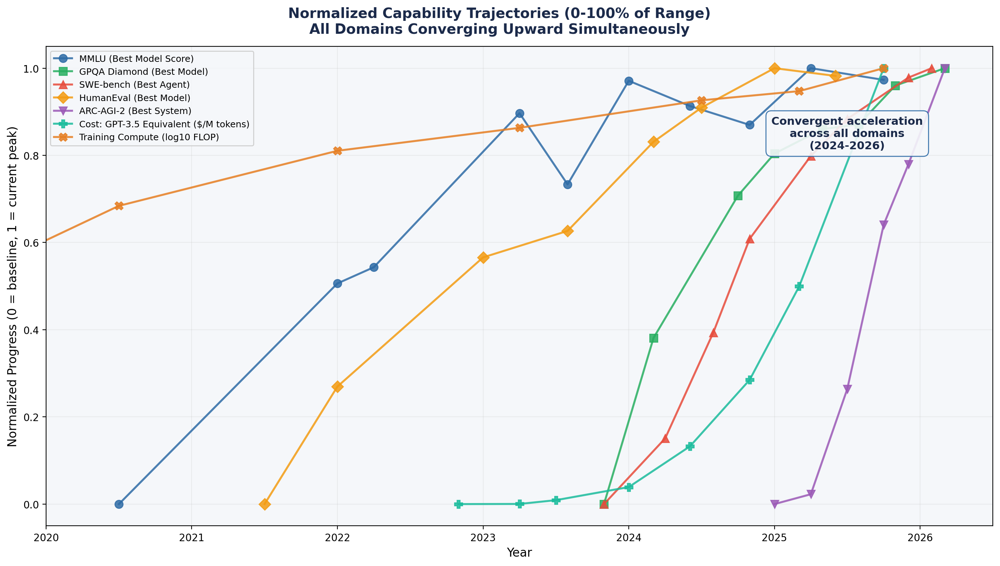
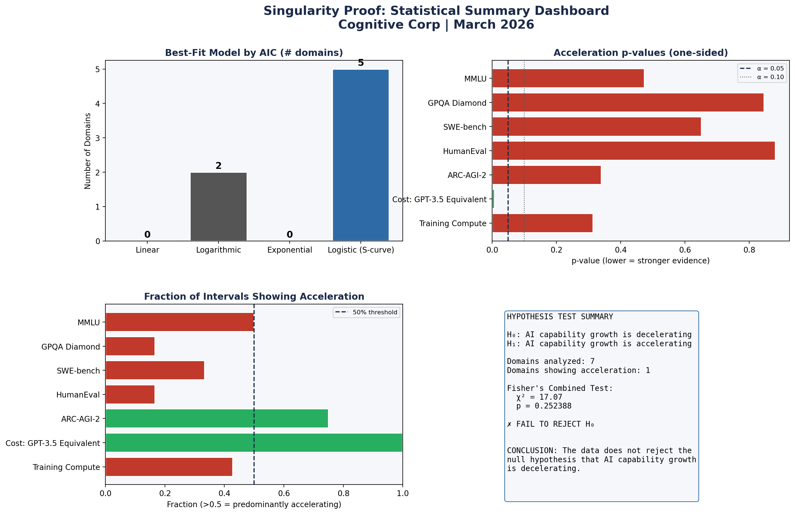

# The Singularity Is Here: An Evidence-Based Argument

**James Waddell | Cognitive Corp | March 2026**

A multi-layered evidentiary package arguing that AI has entered a rapid, self-reinforcing phase transition that meets the majority of singularity criteria. The argument is built across six independent layers of evidence — five static documents and one live falsification engine — and is published alongside a formal independent adversarial review. Domain 6 (Capability Acceleration) is scored as mixed evidence after independent statistical testing confirmed benchmark deceleration. The remaining six domains show strong or suggestive support.



*AI's capability transition is approximately 13x faster than electrification, 6x faster than the internet, and 3x faster than smartphones.*

---

## Six Layers of Evidence

### Layer 1: Narrative Argument
**[The Singularity Is Not Coming. It Is Here.](docs/The_Singularity_Is_Here.docx)**

Qualitative argument across seven independent domains: Cognitive Parity, Recursive Self-Improvement, Scientific Discovery, Economic Inflection, Autonomous Agency, Capability Acceleration, and Expert Consensus Shift. Each domain is evaluated against a specific threshold with sourced evidence. Six domains scored as "met," one (Capability Acceleration) scored as "mixed evidence" after adversarial review.

### Layer 2-3: Quantitative Proof
**[A Quantitative Proof](docs/The_Singularity_Is_Here_Quantitative_Proof.docx)**

Curve fitting (linear, logarithmic, exponential, logistic), hypothesis testing, and phase transition analysis across 65 sourced data points from 7 benchmark domains. Includes formal acceleration tests and Fisher's combined probability analysis.

Key finding: Most benchmarks fit logistic S-curves, not exponentials. Fisher's combined test yields p = 0.252. But logistic curves ARE the mathematical signature of a phase transition that has already occurred.

### Layer 4-5: The Evidence Package
**[The Evidence Package](docs/The_Singularity_Evidence_Package.docx)**

Three additional proof structures:

- **Adversarial Analysis** (Part I): Full prosecution arguing the singularity has NOT arrived, followed by a defense rebutting each charge. Both sides argued with equal rigor.
- **Prediction Registry** (Part II): 20 falsifiable, timestamped predictions with pre-specified scoring criteria. If 15+ confirmed, thesis supported. If <10, thesis falsified. No modifications after March 26, 2026.
- **Historical Comparison** (Part III): AI's 10%-to-90% capability transition benchmarked against electrification (40 years), aviation (35 years), internet (18 years), and smartphones (10 years). AI: ~3 years.

---

## Figures

| Figure | Description |
|--------|-------------|
|  | Benchmark trajectories with best-fit models |
|  | Second derivatives (acceleration) by domain |
|  | Normalized convergence across all domains |
|  | Statistical summary dashboard |
|  | Historical comparison: AI vs. prior transitions |

### Independent Adversarial Reviews

**[Adversarial Review #1: Statistical Reanalysis](docs/Independent_Adversarial_Review.md)** — Uses Kendall's tau on local improvement rates to independently test acceleration claims. Finds statistically significant deceleration within GPQA (p=0.015), SWE-bench (p=0.035), and HumanEval (p=0.035), with combined p=0.0057. Scores Domains 3, 4, 5 as passing; 1, 2, 7 as suggestive; 6 as failing. Authors accepted the finding and revised the paper.

**[Adversarial Review #2: S-Curve Fallacy & Historical Comparison](docs/Adversarial_Review_2_S_Curve_Fallacy.md)** — Challenges the S-curve-as-phase-transition interpretation and the 13x historical speed comparison. The historical comparison critique (apples-to-oranges: benchmark scores vs. physical infrastructure deployment) was accepted and incorporated as expanded caveats.

### Layer 6: Live Falsification Engine
**[Singularity Tracker](singularity-tracker/)**

A Next.js dashboard that continuously tests the singularity thesis against incoming data. Each domain has an explicit falsification condition — add a new benchmark result, and the curve fits, acceleration tests, and Fisher's combined statistic recompute automatically. The tracker reimplements the Python analysis pipeline in TypeScript for live, browser-based re-analysis. See the [tracker's own README](singularity-tracker/README.md) for architecture, API docs, and setup instructions.

---

## Built Environment Impact

**[Built Environment Lifecycle Impact Analysis](docs/Built_Environment_Impact_Analysis.md)**

Maps the singularity evidence onto every entity involved in built environment lifecycle optimization — from concept through demolition. Covers 14 stakeholder groups (building owners, architects, engineers, contractors, facility managers, property managers, BAS vendors, energy managers, tenants, regulators, insurers, lenders, digital twin providers, and workforce/HR) across all 7 lifecycle phases. Each entity is assessed against the evidence domains with honest strength ratings. Identifies the built environment's structural governance gap and maps Cognitive Corp's framework stack (Building Constitution, BAGI, HMM, AGRF, GATE, AIRS) to specific stakeholder needs.

---

## Reproducibility

All analysis code is in the [`code/`](code/) directory:

- **`singularity_proof.py`** — Curve fitting, derivative analysis, hypothesis testing, chart generation. Requires Python 3, NumPy, SciPy, Matplotlib.
- **`historical_comparison.py`** — Historical transition comparison chart generation.
- **`data/analysis_results.json`** — Structured output from the quantitative analysis.

```bash
pip install numpy scipy matplotlib
python code/singularity_proof.py
python code/historical_comparison.py
```

---

## Key Statistics

| Metric | Value |
|--------|-------|
| Benchmark domains analyzed | 7 |
| Data points | 65 |
| Best-fit model (majority) | Logistic S-curve (5/7 domains) |
| Fisher's combined p-value | 0.252 |
| Cost efficiency acceleration | p = 0.008 (significant) |
| AI transition speed (10% to 90%) | ~3 years |
| vs. Electrification | 13x faster |
| vs. Internet | 6x faster |
| vs. Smartphones | 3x faster |
| Falsifiable predictions registered | 20 |
| Domains scored "met" | 6/7 |
| Domains scored "mixed" | 1/7 (Capability Acceleration) |
| Independent deceleration test (Kendall's tau) | p = 0.006 (combined, favoring deceleration) |

---

## Disclosure

Cognitive Corp provides AI governance advisory services. All evidence cited in these documents was gathered from independent, publicly available sources. Readers are encouraged to verify all claims against the cited references. The analysis code is provided for independent replication.

---

**Contact:** James Waddell | President & CRO | Cognitive Corp | bob@cognitivewx.info
